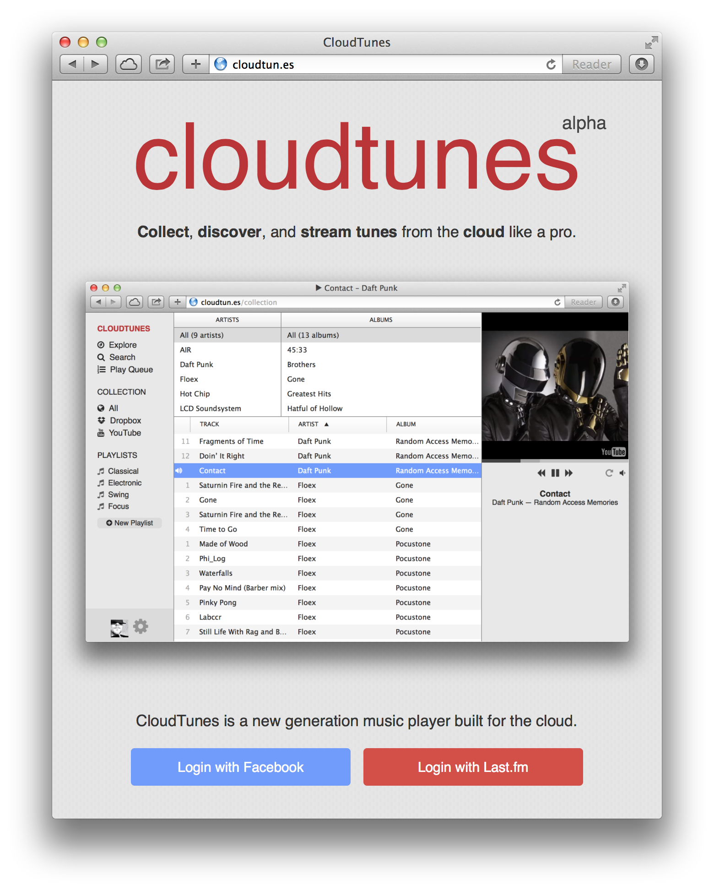
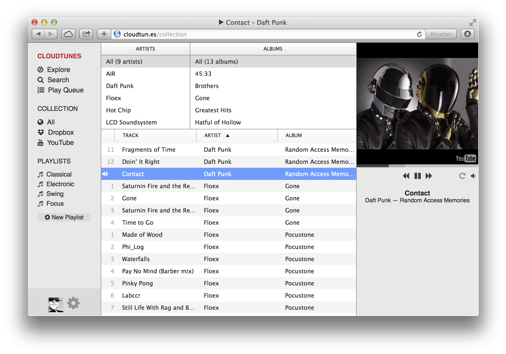
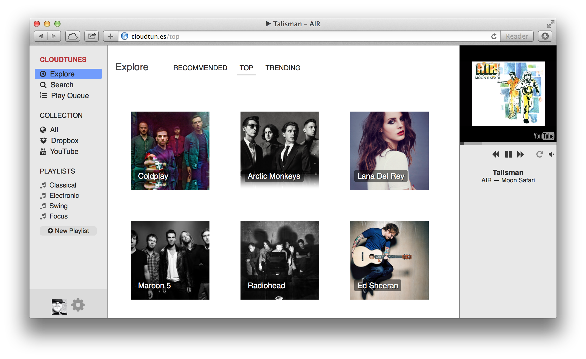
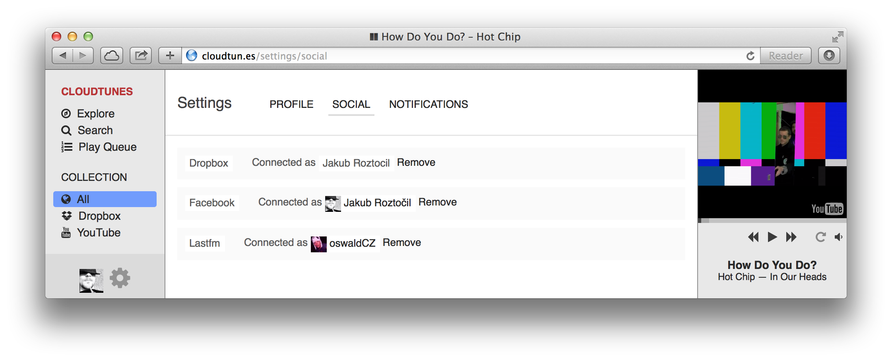
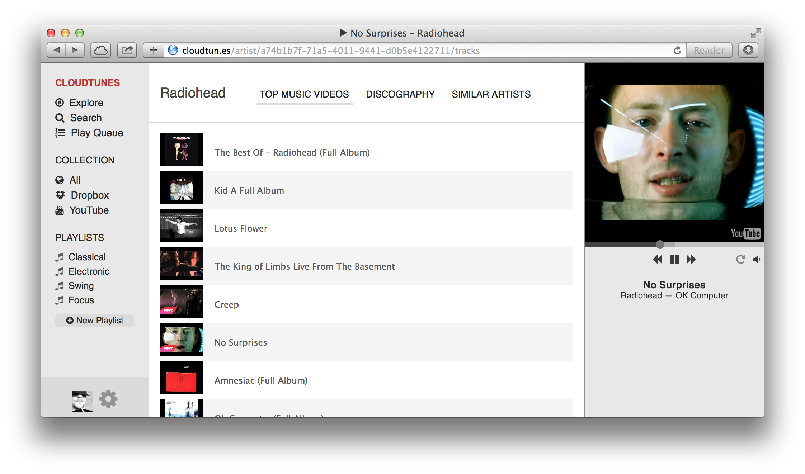
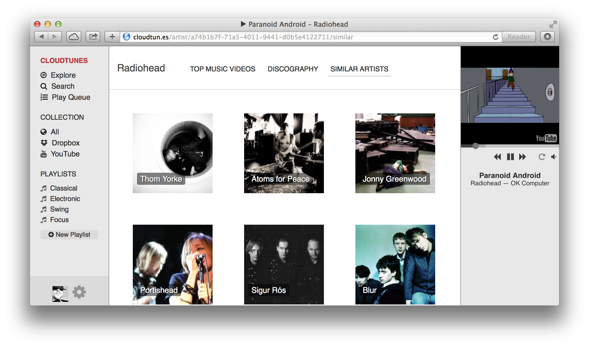
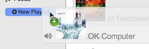
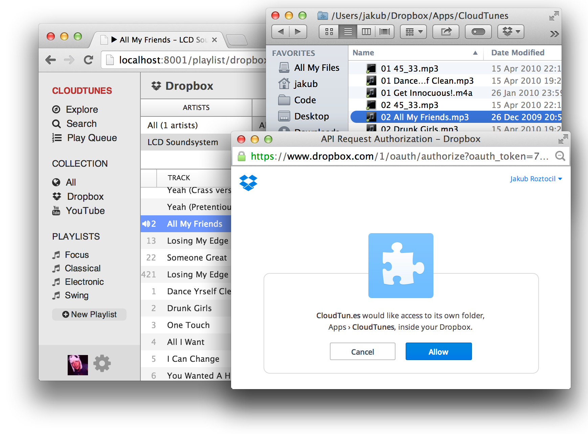
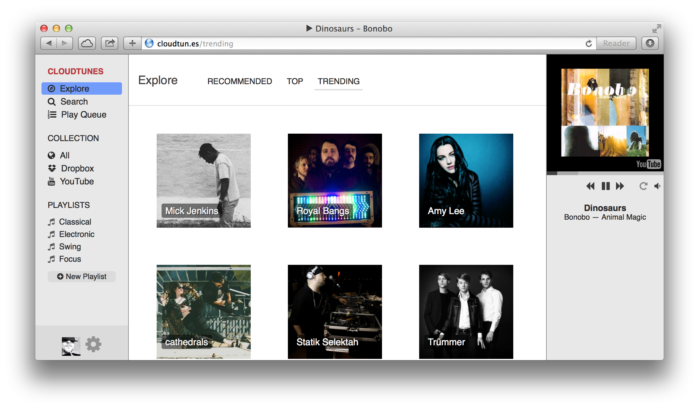
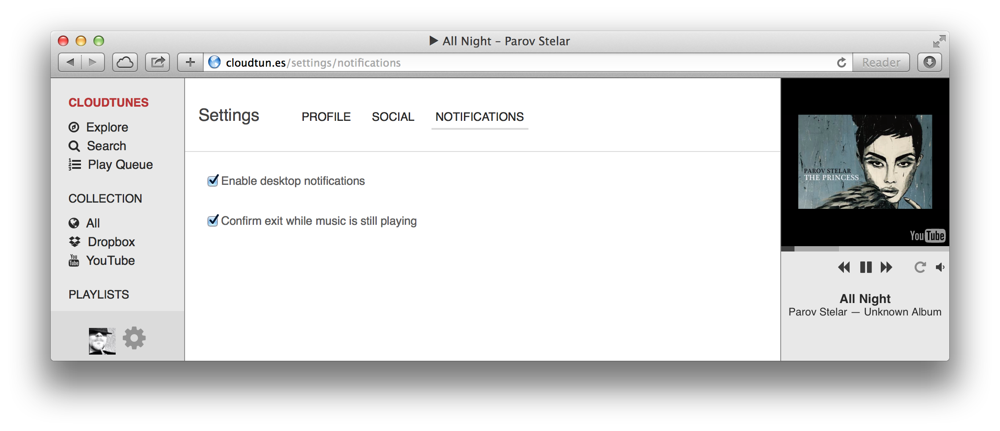

# CloudTunes

**Open source, web-based music player for the cloud.** 
<br/>
Also on: [Facebook](https://www.facebook.com/cloudtunes "/cloudtunes") •
[Twitter](https://twitter.com/cloudtunesapp "@cloudtunesapp") •
[Hacker News](https://news.ycombinator.com/item?id=8284785 "Hacker News discussion")




CloudTunes provides a unified interface 
for music stored in the cloud (YouTube, Dropbox, etc.) and integrates with 
[Last.fm](http://www.last.fm/api), Facebook, 
and [Musicbrainz](https://musicbrainz.org/) for metadata, discovery, 
and social experience. It is similar to services like Spotify, 
except instead of local tracks and the fixed Spotify catalog, 
CloudTunes uses your files stored in Dropbox and music videos on YouTube.







## The Story

CloudTunes is a side project of 
[@jakubroztocil](https://twitter.com/jakubroztocil) who is a bit of a 
[music nerd](http://last.fm/user/oswaldcz) and who likes to 
[build stuff](https://github.com/jakubroztocil).  In 2012 he decided 
to create an iTunes-like webapp to **make music stored all over the cloud 
easily discoverable and accessible:** hence *CloudTunes*. 

One of the goals was to experiment with a bunch of new technologies as well.
Later the side-project has been largely abandoned due to other more pressing 
projects. In the autumn of 2014 CloudTunes has been open-sourced *"as is"* 
(i.e. alpha quality, lack of polish, tests and docs).


## Technology

The architecture consist of a server and client component. Those two are 
decoupled and communicate via a JSON REST API and a WebSocket connection:


### [`cloudtunes-server`](cloudtunes-server)

**Web and WebSocket server, worker processes.**
Written in **Python,** uses Tornado, Celery, Mongo DB, MongoEngine, Redis.


### [`cloudtunes-webapp`](cloudtunes-webapp) 
**Single-page app.** Written in **CoffeeScript and Sass,** uses Brunch, 
Backbone.js, SocketIO, Handlebars, Compass, SoundManager.


## Features

### Discographies & Entire Albums

Find and stream entire albums from YouTube.






Any album or track you like can be added to your collection or any of your playlists.




### Dropbox Integration

Access and stream **music that you already have in Dropbox** from any computer.
Fast indexing and realtime updates.
 



### Playlists

Organise your collection with playlists. Drag and drop tracks and 
albums on a playlist to add them. You can create playlists containing both tracks from your Dropbox and music videos from YouTube.


### Last.fm Support

Scrobble and play your personalised recommendations. 





### Notifications




### Settings


### Miscellaneous

* Drag and drop
* Keyboard shortcuts
* Browse view
* Sorting, resizing
* Support for 10s of 1000s of tracks in collection


## Installation

1. Clone this repository:

  ```bash
  $ git clone https://github.com/jakubroztocil/cloudtunes.git
  $ cd cloudtunes
  ```

2. Use [`cloudtunes-server/cloudtunes/settings/local.example.py`](cloudtunes-server/cloudtunes/settings/local.example.py) as a template and fill in the `None`'s:

  ```bash
  $ cp  cloudtunes-server/cloudtunes/settings/local.example.py cloudtunes-server/cloudtunes/settings/local.py
  $ vim cloudtunes-server/cloudtunes/settings/local.py
  ```
3. Decide whether to continue with or without Docker and follow the specific instructions bellow.

### Without Docker

Continue by following the instructions in:

* [`cloudtunes-server/README`](cloudtunes-server)
* [`cloudtunes-webapp/README`](cloudtunes-webapp)

### With Docker

The easiest way to run CloudTunes is in an isolated 
[Docker](https://docker.com/whatisdocker/) container. Like this, 
the only thing you need to install directly on your system is Docker 
(or `boot2docker`) itself.

Please follow the 
[installation instructions](https://docs.docker.com/installation/#installation) 
on how to install Docker (or `boot2docker`) on your system. Then follow the
steps bellow:


1.  **Build** a Docker image according to our [`Dockerfile`](Dockerfile) 
  and name it `cloudtunes-img`. This takes a long time the first time
  it's run:

  ```bash
  $ docker build --tag=cloudtunes-img .
  ```

2. **Verify** the image has been created:

  ```bash
  $ docker images
  REPOSITORY          TAG                 IMAGE ID            CREATED             VIRTUAL SIZE
  cloudtunes-img      latest              e1bcb48ab148        About an hour ago   995.1 MB
  ```

3. **Create** a new container named `cloudtunes ` from the `cloudtunes-img` 
  image and run the app in it:

  ``` bash
  $ docker run --name=cloudtunes --publish=8000:8000  --detach --tty cloudtunes-img
  ```

4. **Verify** the container is running:

  ```bash
  $ docker ps
  CONTAINER ID        IMAGE                   COMMAND                CREATED             STATUS              PORTS                    NAMES
  564cc245e6dd        cloudtunes-img:latest   "supervisord --nodae   52 minutes ago      Up 2 minutes        0.0.0.0:8000->8000/tcp   cloudtunes
  
  ```
  
5. Now CloudTunes should be running in the Docker container on port `8000`. 
  The full URL depends on the method you used to install Docker:

  * If you have installed **Docker directly** on your system, the full 
    URL will simply be: [`http://localhost:8000/`](http://localhost:8000/)
  * If you have used **`boot2docker`,** then run `$ boot2docker ip` 
    to find out the IP address under which the app is available, 
    and the full URL will be `http://<boot2docker IP>:8000/`


To stop the app (Docker container), run:

```bash
$ docker stop cloudtunes
```

To start it again, run:
```bash
$ docker start cloudtunes
```

All user data (stored by MongoDB and Redis under `/data`) will persist until the container has been deleted.  

After you have made any changes to the codebase or configuration and 
want them to be applied to the container, or simply wish to start 
from scratch again, run the following commands to delete the 
existing container (*this will also delete all user data in it*):

```bash
$ docker stop cloudtunes
$ docker rm cloudtunes
```

And then start again from step 1. above (it should go much faster this time).

## License

BSD. See [LICENSE](LICENSE) for more details.

## Contact 

Jakub Roztočil

* [https://github.com/jakubroztocil](https://github.com/jakubroztocil)
* [https://twitter.com/jakubroztocil](https://twitter.com/jakubroztocil)
